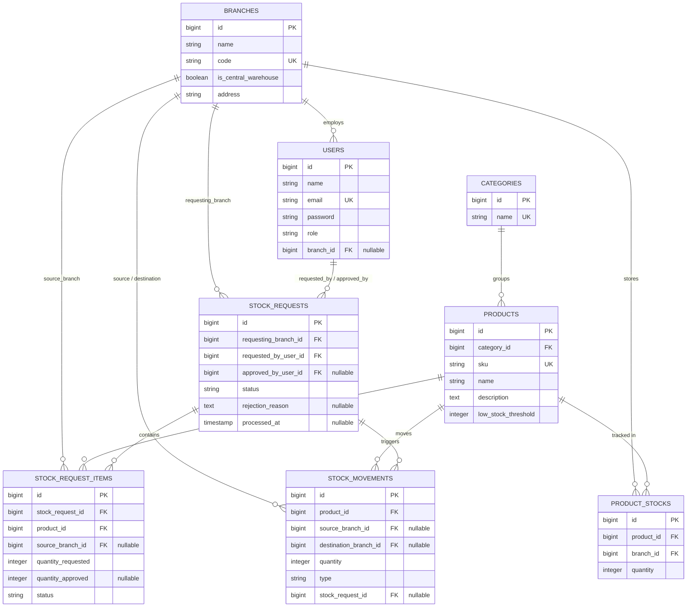

# InventYou: Multi-Branch Inventory & Order Management System

InventYou adalah sistem manajemen inventory dan distribusi stok untuk bisnis retail atau distribusi dengan banyak cabang. Sistem ini mengelola pergerakan stok antara satu gudang pusat dan beberapa cabang, lengkap dengan alur persetujuan permintaan stok, audit trail pergerakan barang, dan pelaporan.

Repositori ini adalah backend REST API dari InventYou, dibangun dengan Laravel. Frontend-nya berada di repositori terpisah: [inventyou-web](../inventyou-web).

## Daftar Isi

- [Latar Belakang dan Tujuan](#latar-belakang-dan-tujuan)
- [Alur Bisnis](#alur-bisnis)
- [Peran Pengguna](#peran-pengguna)
- [Arsitektur Data](#arsitektur-data)
- [Keputusan Desain Teknis](#keputusan-desain-teknis)
- [Tech Stack](#tech-stack)
- [Struktur API](#struktur-api)
- [Instalasi](#instalasi)
- [Menjalankan Test](#menjalankan-test)
- [Pengguna Percobaan (Seeder)](#pengguna-percobaan-seeder)

## Latar Belakang dan Tujuan

Project ini dibangun sebagai studi kasus relational data modeling dan business logic pada sistem multi-cabang, dengan fokus utama pada tiga hal:

1. Pemodelan data relasional yang mencerminkan hierarki organisasi nyata (gudang pusat dan banyak cabang).
2. Alur kerja transaksional yang aman terhadap kondisi konkuren (concurrency), khususnya pada proses pengurangan dan penambahan stok.
3. Kontrol akses berbasis peran yang berlapis, tidak hanya berdasarkan jenis peran tetapi juga kepemilikan data (cabang mana yang boleh diakses oleh pengguna tertentu).

## Alur Bisnis

### Struktur Organisasi

Seluruh cabang dan gudang pusat disimpan dalam satu tabel `branches`, dibedakan melalui flag `is_central_warehouse`. Pendekatan ini dipilih agar gudang pusat dapat diperlakukan sebagai entitas cabang biasa dalam banyak operasi (memiliki stok, dapat menjadi sumber maupun tujuan pergerakan barang), sambil tetap memiliki privilese berbeda dalam proses persetujuan.

### Siklus Permintaan Stok

Siklus utama aplikasi ini berpusat pada permintaan stok dari cabang ke gudang pusat:

1. **Pengajuan.** Staf di sebuah cabang mengajukan permintaan stok untuk satu atau beberapa produk sekaligus dalam satu pengajuan. Setiap pengajuan otomatis mencatat cabang asal dan pengaju, dengan status awal `pending`.

2. **Peninjauan.** Hanya Warehouse Admin di gudang pusat, atau Super Admin, yang berwenang meninjau dan memproses pengajuan. Warehouse Admin di cabang biasa tidak memiliki kewenangan menyetujui permintaan, termasuk permintaan dari cabangnya sendiri.

3. **Keputusan per item.** Peninjauan dilakukan pada level item, bukan pada level pengajuan secara keseluruhan. Untuk setiap item, admin peninjau memutuskan salah satu dari dua hal:
    - **Menyetujui**, dengan menentukan cabang sumber pengiriman dan jumlah yang disetujui. Cabang sumber tidak harus gudang pusat; sistem mengizinkan pengiriman dari cabang mana pun yang memiliki stok mencukupi, memberi admin fleksibilitas untuk mengoptimalkan distribusi.
    - **Menolak**, tanpa perlu alasan wajib.

    Karena keputusan diambil per item, satu pengajuan yang berisi banyak produk dapat berakhir dengan sebagian item disetujui dan sebagian ditolak. Status pengajuan secara keseluruhan dihitung ulang secara otomatis berdasarkan kombinasi status seluruh itemnya: `approved` jika semua disetujui, `rejected` jika semua ditolak, atau `partially_approved` jika campuran.

4. **Validasi otomatis saat persetujuan.** Sistem menolak persetujuan secara otomatis, tanpa intervensi manual, dalam dua kondisi: jika jumlah yang disetujui melebihi jumlah yang diminta, atau jika stok di cabang sumber yang dipilih tidak mencukupi. Validasi ini terjadi pada level data terbaru saat persetujuan diproses, bukan pada saat pengajuan dibuat, karena kondisi stok dapat berubah di antara kedua waktu tersebut.

5. **Eksekusi pergerakan stok.** Setiap item yang disetujui akan memicu tiga perubahan yang terjadi sebagai satu kesatuan: stok di cabang sumber berkurang, stok di cabang tujuan bertambah (dibuat baru jika belum pernah ada), dan satu baris riwayat pergerakan dicatat dengan tipe `transfer`.

### Penambahan Stok Baru

Selain perpindahan antar cabang, sistem menyediakan mekanisme untuk memasukkan stok baru ke dalam sistem, misalnya saat barang tiba dari pemasok. Operasi ini disebut `initial_stock` pada riwayat pergerakan, dibedakan dari `transfer` karena tidak memiliki cabang sumber. Kewenangan untuk operasi ini dibatasi pada Warehouse Admin gudang pusat dan Super Admin, mencerminkan asumsi bahwa barang masuk selalu melalui gudang pusat terlebih dahulu.

### Audit Trail

Setiap perubahan kuantitas stok, baik akibat transfer maupun penambahan awal, dicatat sebagai satu baris pada riwayat pergerakan stok (`stock_movements`). Baris ini menyimpan produk, cabang asal (jika ada), cabang tujuan, jumlah, tipe pergerakan, dan tautan ke pengajuan terkait (jika berasal dari proses persetujuan). Riwayat ini menjadi sumber kebenaran untuk pelaporan dan tidak pernah diubah setelah dibuat, hanya ditambahkan.

## Peran Pengguna

| Peran                              | Cakupan Akses                                                                                                                                |
| ---------------------------------- | -------------------------------------------------------------------------------------------------------------------------------------------- |
| **Super Admin**                    | Akses penuh ke seluruh cabang, produk, pengguna, dan pengajuan. Satu-satunya peran yang dapat mengelola data cabang dan pengguna.            |
| **Warehouse Admin (gudang pusat)** | Dapat meninjau dan memproses seluruh pengajuan dari semua cabang. Dapat mengelola produk dan kategori. Dapat menambahkan stok baru.          |
| **Warehouse Admin (cabang biasa)** | Mengelola stok dan melihat riwayat pergerakan pada cabangnya sendiri. Tidak berwenang menyetujui pengajuan, termasuk dari cabangnya sendiri. |
| **Staff**                          | Mengajukan permintaan stok dan memantau status pengajuannya sendiri. Melihat data stok pada cabangnya secara baca saja.                      |

Kontrol akses diterapkan pada dua lapis: peran (role), dan kepemilikan data (data ownership). Middleware peran menentukan jenis operasi apa yang boleh diakses oleh peran tertentu, sementara pemeriksaan tambahan pada level controller memastikan pengguna hanya dapat mengakses data milik cabangnya, kecuali untuk peran dengan cakupan lintas cabang.

## Arsitektur Data

```
branches ──┬── users
           ├── product_stocks ── products ── categories
           ├── stock_requests (sebagai cabang pemohon)
           └── stock_movements (sebagai cabang asal / tujuan)

stock_requests ── stock_request_items ── products
               └── stock_movements
```

Tabel `product_stocks` menyimpan kuantitas per kombinasi produk dan cabang, dengan batasan unik pada pasangan `product_id` dan `branch_id`. Tabel ini dimodelkan sebagai entitas tersendiri dengan primary key sendiri, bukan sebagai tabel pivot murni, karena kuantitasnya diperbarui secara berkala dan memerlukan penguncian baris pada saat transaksi bersamaan.

Tabel `stock_requests` menyimpan informasi pengajuan pada level header (cabang pemohon, pengaju, status keseluruhan), sementara `stock_request_items` menyimpan detail per produk dalam pengajuan tersebut, termasuk cabang sumber dan status yang ditentukan secara independen saat peninjauan.

### Entity Relationship Diagram



Catatan pada relasi:

- `product_stocks` memiliki batasan unik pada pasangan `(product_id, branch_id)`, memastikan satu produk hanya memiliki satu baris kuantitas per cabang.
- `stock_request_items.source_branch_id` diisi hanya pada saat item disetujui, mencerminkan bahwa cabang sumber ditentukan saat peninjauan, bukan saat pengajuan dibuat.
- `stock_movements.stock_request_id` bersifat nullable karena tidak semua pergerakan stok berasal dari alur persetujuan pengajuan; penambahan stok baru (`initial_stock`) tidak memiliki tautan ke pengajuan mana pun.
- Sebagian besar foreign key menggunakan `restrictOnDelete`, mencegah penghapusan data induk (kategori, produk, cabang) selama masih direferensikan oleh data transaksi. Pengecualian pada `stock_request_items.stock_request_id`, yang menggunakan `cascadeOnDelete` karena item tidak memiliki makna independen tanpa pengajuan induknya.

## Keputusan Desain Teknis

**Keamanan konkurensi.** Proses persetujuan stok melibatkan pembacaan dan penulisan pada baris `product_stocks` yang berpotensi diakses bersamaan oleh lebih dari satu proses peninjauan. Untuk mencegah kondisi balapan (race condition), setiap operasi persetujuan dibungkus dalam database transaction dengan penguncian baris (`lockForUpdate`) pada baris stok yang relevan sebelum melakukan pengurangan atau penambahan kuantitas.

**Kegagalan sebagian, bukan seluruhnya.** Jika satu pengajuan berisi beberapa item dan salah satu item gagal diproses karena stok tidak mencukupi, item tersebut ditolak secara otomatis tanpa menggagalkan proses item lain dalam batch yang sama. Setiap item diproses dalam transaction terpisah, sehingga kegagalan satu item tidak memerlukan pengulangan pada item yang sebenarnya valid.

**Enum sebagai kolom string, bukan enum native database.** Status dan tipe (peran pengguna, status pengajuan, tipe pergerakan stok) disimpan sebagai kolom string biasa di database, dipetakan ke PHP Backed Enum pada level aplikasi. Pendekatan ini menghindari migrasi skema database setiap kali ada penambahan nilai baru, sambil tetap mempertahankan keamanan tipe pada level kode.

**Pemisahan logika bisnis dari controller.** Logika persetujuan pengajuan, termasuk perhitungan ulang status header berdasarkan status seluruh item, ditempatkan pada service class (`StockRequestService`) alih-alih pada controller atau model event. Pendekatan ini membuat alur logika lebih mudah ditelusuri secara eksplisit dan diuji secara terpisah dari lapisan HTTP.

**Otorisasi berlapis di luar middleware peran.** Middleware peran hanya memverifikasi jenis peran, bukan kepemilikan data. Pemeriksaan tambahan pada level controller memverifikasi bahwa pengguna dengan cakupan terbatas (Staff, Warehouse Admin cabang biasa) hanya dapat mengakses data pada cabangnya sendiri, sementara peran dengan cakupan lintas cabang (Super Admin, Warehouse Admin gudang pusat) dikecualikan dari batasan ini.

## Tech Stack

- **Backend:** Laravel 13, PHP 8.3
- **Database:** PostgreSQL
- **Autentikasi:** Laravel Sanctum (token API)
- **Ekspor Laporan:** Laravel Excel, DomPDF
- **Testing:** PHPUnit

## Struktur API

Seluruh endpoint berada di bawah prefix `/api` dan memerlukan autentikasi melalui header `Authorization: Bearer <token>`, kecuali endpoint login.

| Grup           | Endpoint                                                                                  | Keterangan                                               |
| -------------- | ----------------------------------------------------------------------------------------- | -------------------------------------------------------- |
| Autentikasi    | `POST /login`, `POST /logout`, `GET /me`                                                  | Autentikasi berbasis token                               |
| Cabang         | `GET/POST/PUT/DELETE /branches`                                                           | Terbatas untuk Super Admin                               |
| Kategori       | `GET /categories`, `POST/PUT/DELETE /categories`                                          | Baca untuk semua peran, tulis untuk admin                |
| Produk         | `GET /products`, `POST/PUT/DELETE /products`                                              | Baca untuk semua peran, tulis untuk admin                |
| Stok           | `GET /branches/{branch}/stocks`, `GET /products/{product}/stocks`, `POST /product-stocks` | Termasuk penambahan stok baru                            |
| Pengajuan Stok | `GET/POST /stock-requests`, `POST /stock-requests/{id}/approve`                           | Inti alur bisnis persetujuan                             |
| Riwayat Stok   | `GET /stock-movements`                                                                    | Dengan filter dan paginasi                               |
| Pengguna       | `GET/POST/PUT/DELETE /users`                                                              | Terbatas untuk Super Admin                               |
| Dashboard      | `GET /dashboard`, `GET /dashboard/stock-trend`                                            | Konten disesuaikan per peran                             |
| Ekspor         | `GET /stock-movements/export/{excel,pdf}`, `GET /product-stocks/export/{excel,pdf}`       | Menghormati cakupan akses yang sama dengan endpoint data |

## Instalasi

### Prasyarat

- PHP 8.3 atau lebih baru, dengan ekstensi `pdo_pgsql` dan `zip` aktif
- Composer
- PostgreSQL

### Langkah

```bash
git clone <url-repositori>
cd inventyou-api

composer install
cp .env.example .env
php artisan key:generate
```

Sesuaikan kredensial database pada `.env`:

```
DB_CONNECTION=pgsql
DB_HOST=127.0.0.1
DB_PORT=5432
DB_DATABASE=inventory_system
DB_USERNAME=postgres
DB_PASSWORD=
```

Jalankan migrasi dan seeder:

```bash
php artisan migrate --seed
php artisan serve
```

API akan tersedia di `http://127.0.0.1:8000`.

## Menjalankan Test

Test menggunakan database PostgreSQL terpisah untuk menghindari konflik dengan data pengembangan.

```bash
# Buat database terpisah untuk testing, misal inventory_system_test

cp .env.example .env.testing
# Sesuaikan .env.testing untuk menunjuk ke database testing

php artisan migrate --env=testing
php artisan test
```

## Pengguna Percobaan (Seeder)

Setelah menjalankan `php artisan migrate --seed`, tiga akun berikut tersedia dengan kata sandi `password`:

| Peran           | Email                         | Cabang         |
| --------------- | ----------------------------- | -------------- |
| Super Admin     | superadmin@inventyou.test     | —              |
| Warehouse Admin | warehouseadmin@inventyou.test | Gudang Pusat   |
| Staff           | staff@inventyou.test          | Cabang Bandung |
